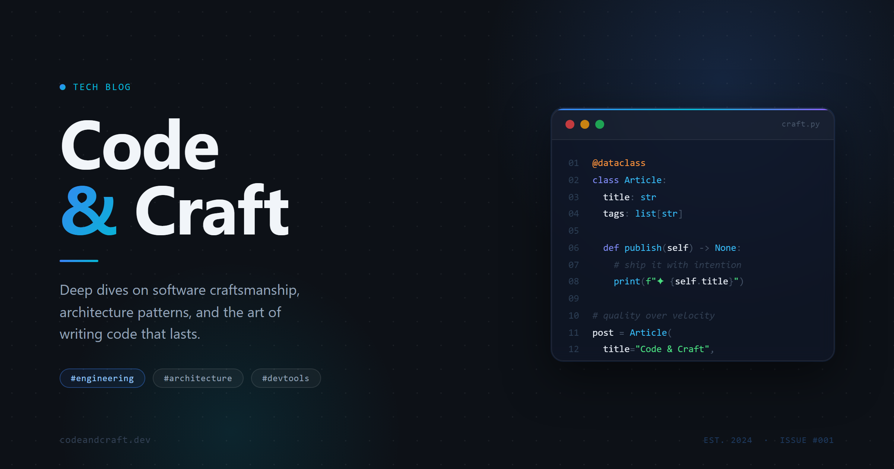
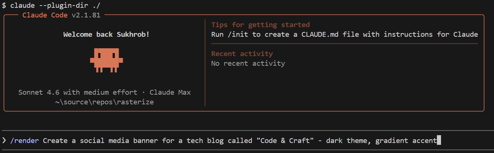
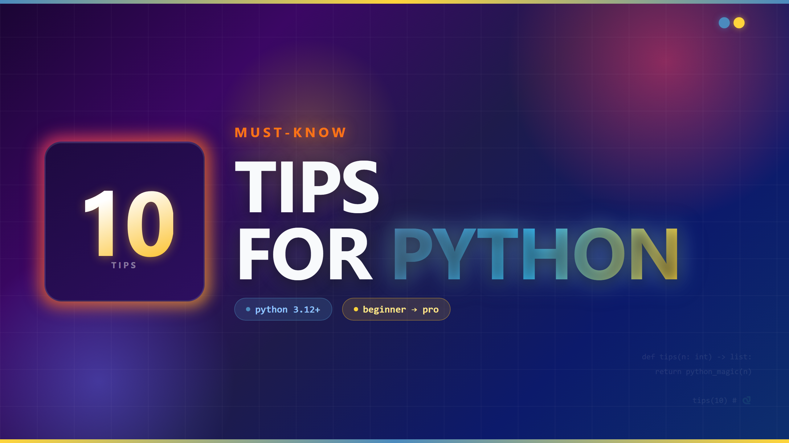
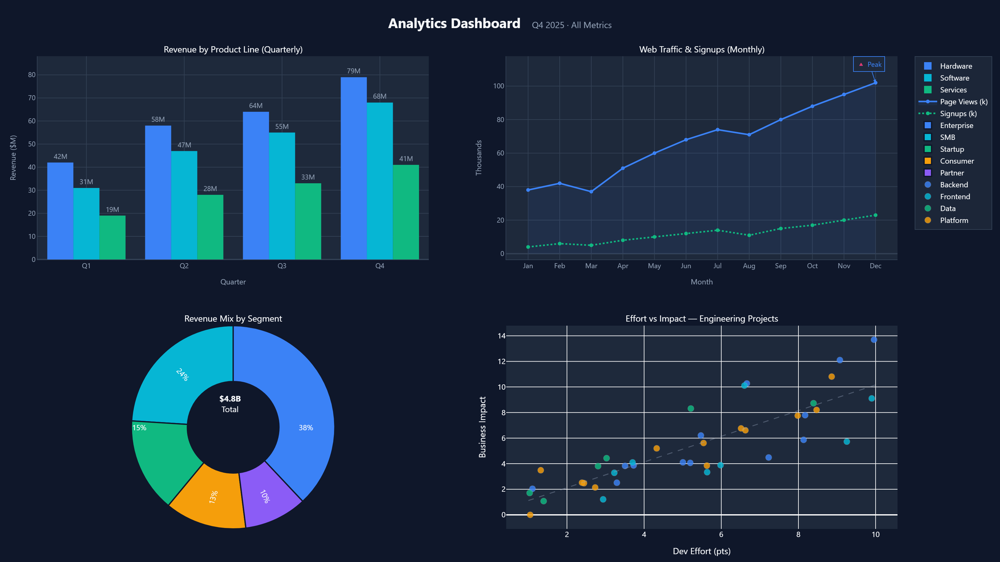
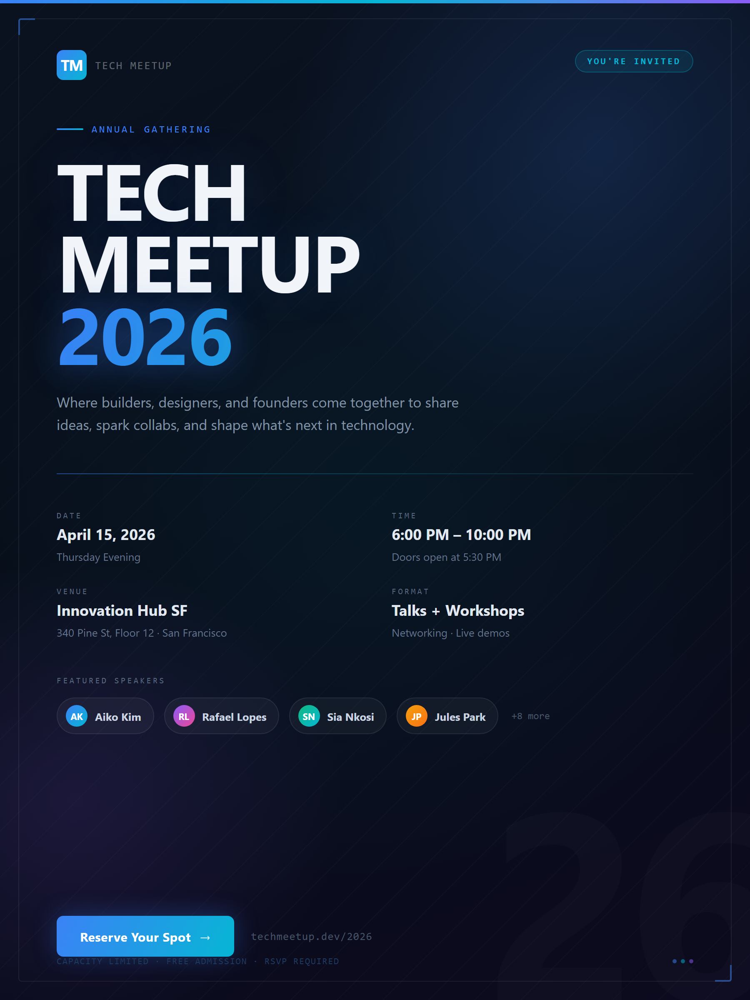
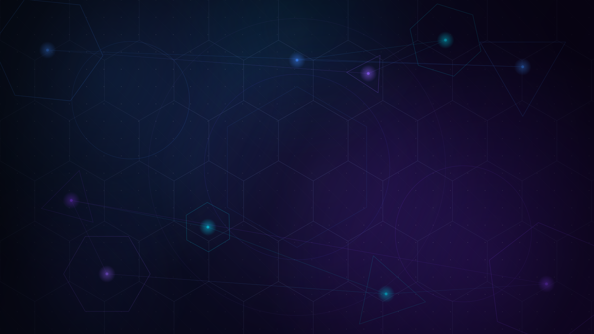

# Rasterize

A [Claude Code](https://docs.anthropic.com/en/docs/claude-code) plugin that generates raster images (PNG, JPEG, WebP) from natural language prompts using Python rendering engines - charts, banners, layouts, logos, data visualizations, and procedural art.



## What It Does

Describe what you want, and Rasterize picks the best engine, writes a Python script, runs it, and delivers the image.

| Engine | Best for | Examples |
| ------ | -------- | -------- |
| **Pillow** | Photo compositing, filters, pixel ops, gradients | Banners, thumbnails, backgrounds |
| **Cairo** | Vector-style graphics, anti-aliased shapes, procedural art | Logos, icons, badges, geometric art |
| **Matplotlib** | Statistical charts, scientific plots | Bar charts, line plots, heatmaps |
| **Plotly** | Rich dashboards, annotated data viz, 3D surfaces | Multi-panel dashboards, scatter plots |
| **Playwright** | HTML/CSS layouts, complex typography, UI mockups | Social cards, pricing tables, event invites |

## Quick Start

### Prerequisites

- [Claude Code](https://docs.anthropic.com/en/docs/claude-code) CLI
- [Python 3.14+](https://www.python.org/downloads/)

### 1. Install

```bash
git clone https://github.com/suxrobgm/rasterize.git
claude --plugin-dir ./rasterize
```



### 2. Set up engines

Rasterize uses [pdm](https://pdm-project.org/) to manage a virtual environment with all rendering engines:

```bash
cd rasterize
python scripts/setup.py
```

This will:

- Install pdm if not present (`python -m pip install pdm --user`)
- Create a `.venv` and install all dependencies
- Download Playwright's Chromium browser

### 3. Start creating

```bash
# Graphics & Branding
/render Create a social media banner for a tech blog called "Code & Craft" — dark theme, gradient accent

# Data Visualization
/render Plot a bar chart of quarterly revenue: Q1=$42M, Q2=$58M, Q3=$35M, Q4=$71M

# Layouts & Cards
/render Design an event invitation card for "Tech Meetup 2026" with date, venue, and modern layout

# Backgrounds
/render Create a dark gradient hero background (1920x1080) with subtle geometric shapes

# YouTube Thumbnails
/render Generate a YouTube thumbnail with bold text "10 Tips for Python" on a vibrant background

# Dashboards
/render Generate a 4-panel dashboard image with a bar chart, line chart, pie chart, and heatmap
```

## Example Output

| Prompt | Result |
| ------ | ------ |
| Social media banner for "Code & Craft" |  |
| YouTube thumbnail "10 Tips for Python" |  |
| 4-panel dashboard with sample data |  |
| Event invitation card for "Tech Meetup 2026" |  |
| Dark gradient hero background |  |

## Documentation

- [Project Structure](docs/project-structure.md) — directory layout, key directories, and what each part does

## Engine Status

Check which engines are installed:

```bash
pdm run python scripts/check_engines.py
```

Install any missing engines:

```bash
pdm run python scripts/check_engines.py --install
```

## How It Works

1. You describe the image you want in natural language
2. Rasterize routes your request to the best engine using the routing table
3. It reads the engine's reference doc for patterns and best practices
4. It writes a self-contained Python generation script
5. It runs the script via `pdm run python` in the plugin's venv
6. The script and output image are saved in `generated/` for iteration

The generation script is kept after delivery so you can ask for tweaks ("make the text bigger", "change the color") without regenerating from scratch.

## Limitations

Rasterize uses **code-based rendering**, not AI image generation models. This means:

- **No photorealistic images** - it cannot generate photos of people, nature, animals, or real-world scenes
- **No AI art** - diffusion/generative AI styles (Midjourney, DALL-E, Stable Diffusion) are not supported
- **Stylized only** - it can create geometric, flat, pixel art, and procedural representations, but not realistic ones
- **SVG not supported** - this plugin is specifically for raster output (PNG, JPEG, WebP)

> AI image generation via external APIs (e.g. DALL-E, Stable Diffusion, Flux) may be added as a future engine.

## License

MIT
